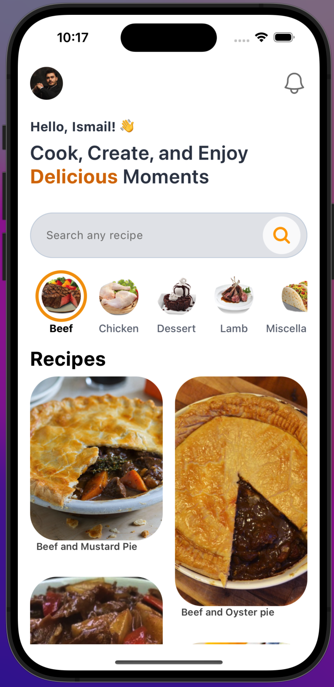
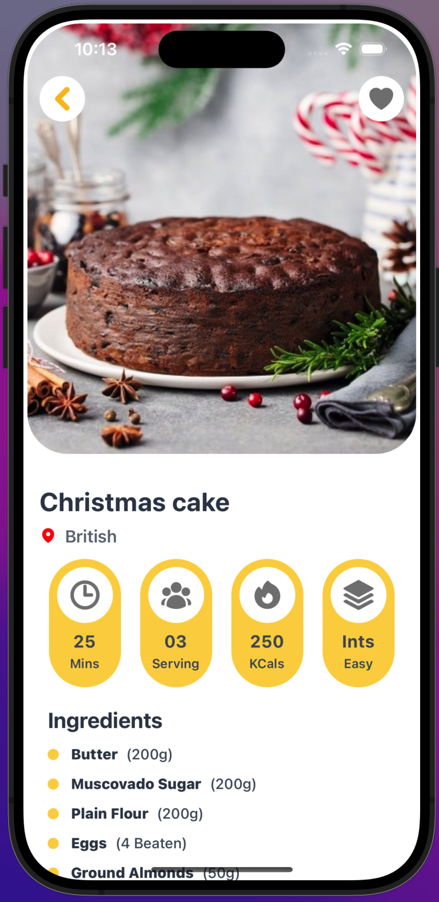
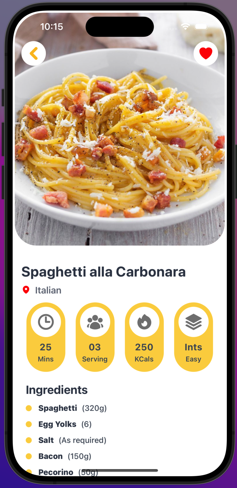
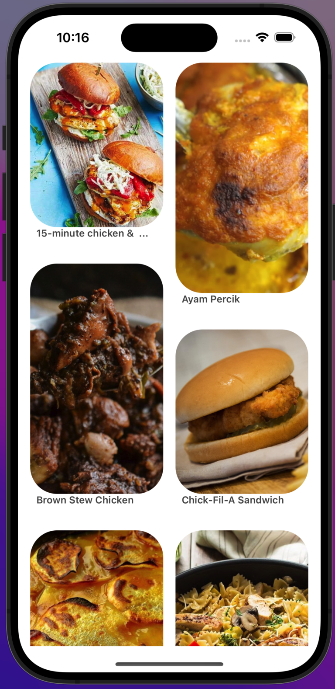
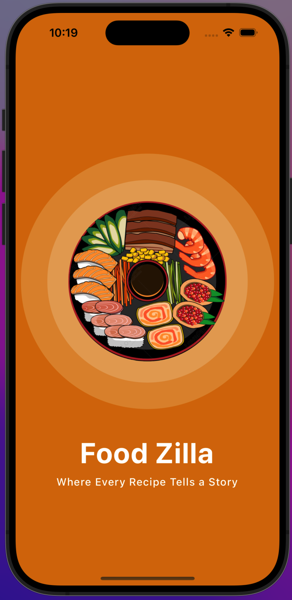

# Food Zilla 🍲📱

**Food Zilla** is an innovative food recipe app developed using React Native and Expo. The app provides a visually appealing and user-friendly experience, combining smooth animations, modern design, and efficient image caching. Available on both iOS and Android, Food Zilla aims to offer an engaging and seamless way to discover and explore recipes.

## Features

- **🎨 Seamless Animations**: Implemented using the `react-reanimated` library for smooth and captivating transitions.
- **💨 Modern Design**: Styled with TailwindCSS classes using `nativeWind` for a sleek and contemporary look.
- **📌 Pinterest-like Masonry View**: Utilizes the `reanimated-masonry-list` library for a visually appealing grid layout.
- **💾 Efficient Image Caching**: Images are cached using `react-native-async-storage` for quick and efficient loading.
- **🌐 Cross-Platform Compatibility**: Fully functional on both iOS and Android devices.

## Getting Started

### Prerequisites

- **Node.js**: Ensure you have Node.js installed. You can download it from [Node.js](https://nodejs.org/).
- **Expo CLI**:No need to Install Expo CLI globally. It is based on Local Expo CLI Package.
- **Git**: Ensure you have Git installed. You can download it from [Git](https://git-scm.com/).

### Installation

1. **Clone the repository**:

   ```bash
   git clone https://github.com/ismailxkhalid/Food-Zilla.git
   cd Food-Zilla
   ```

2. **Install dependencies**:

   ```bash
   npm install
   ```

3. **Start the Expo server**:
   ```bash
   npx expo start
   ```

## Usage

1. **Run on iOS**:

   - Ensure you have Xcode installed.
   - Press `i` in the terminal to open the iOS simulator.

2. **Run on Android**:

   - Ensure you have Android Studio installed.
   - Press `a` in the terminal to open the Android emulator.

3. **Run on a physical device**:
   - Download the Expo Go app from the App Store (iOS) or Google Play (Android).
   - Scan the QR code generated in the terminal after running `npx expo start`.

## Libraries and Tools Used

- **React Native**: [React Native](https://reactnative.dev/)
- **Expo**: [Expo](https://expo.dev/)
- **React Reanimated**: [react-reanimated](https://docs.swmansion.com/react-native-reanimated/)
- **NativeWind**: [nativeWind](https://nativewind.dev/)
- **Reanimated Masonry List**: [reanimated-masonry-list](https://github.com/quangtran2303/reanimated-masonry-list)
- **React Native Async Storage**: [react-native-async-storage](https://github.com/react-native-async-storage/async-storage)

## Screenshots

 


## Video Demonstration

Check out this video to see Food Zilla in action:
[](https://www.linkedin.com/posts/ismailxkhalid_reactnative-expo-mobileappdevelopment-activity-7224868552921522176-5Etm?utm_source=share&utm_medium=member_desktop)
